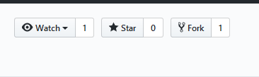
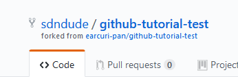
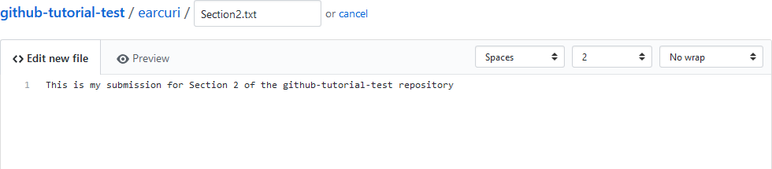
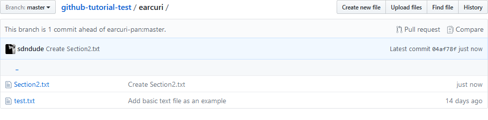
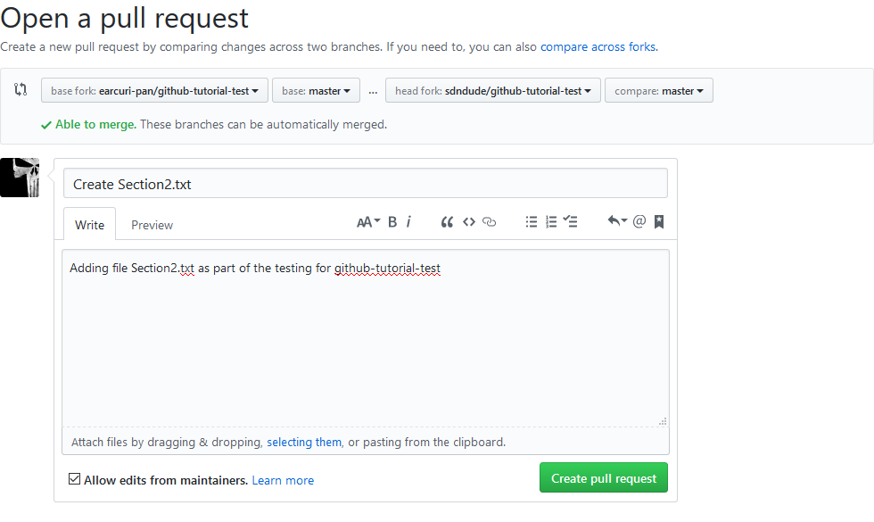
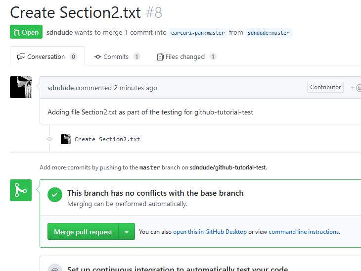

# github-tutorial-test

This is the repository to show off your abilities with Git and GitHub.  

There are two sections for executing the test.  
* [Section 1](#Section-1) is a scenario where you are part of a team, just like you would be here at Palo Alto Networks, and you are working in a **Shared Repository** and have been given collaborator permissions on the repo.  

* [Section 2](#Section-2) is how you will deal with open source projects where you don't know the maintainers at all but still want to contribute.  The second section will work regardless of whether you are a collaborator or not.  The first section requires that you be a collaborator

First, you will need to [set up ssh keys](https://help.github.com/articles/generating-a-new-ssh-key-and-adding-it-to-the-ssh-agent/).  In the future, it is suggested that you use SSH wherever possible.  If (when) you are added to the Palo Alto Networks GitHub organization, you will be required to use two-factor authentication with all GitHub pulls/pushes to that org.  Using ssh keys will minimize the run-around that the 2FA causes.  Using https to push/pull requires adding a [personal access token](https://help.github.com/articles/creating-a-personal-access-token-for-the-command-line) and then adding it to a keychain, which is different for every OS, of course.   

## Section 1 
Send an email to the SP-Solutions team (address is on Page 19 of the tutorial document) with your GitHub userid and the request to be added as a collaborator on the repository.  Please allow 24 hours for this request to be filled.  

Pull Requests are commonly used by teams and organizations collaborating using the **Shared Repository Model**, where everyone shares a single repository and topic branches are used to develop features and isolate changes. Many open source projects on Github use pull requests to manage changes from contributors as they are useful in providing a way to notify project maintainers about changes one has made and in initiating code review and general discussion about a set of changes before being merged into the main branch.

To accomplish this you will need to create a branch, stage and commit your changes and then push your branch up to the repository and  then submit a pull-reqest to have your branch merged with the master branch.  It may seem that this is a "push-request" but what you are actually doing is asking to have your code/text/changes ***pulled*** into the repository by the administrator.

Once you have received an email stating that access has been granted, you can do the following:

To execute the test, do the following:
1. Clone this repository and change into the directory
2. Create a new branch by using this command - "*git checkout -b \<branchname\>*"
   ##### In the command above, the branchname can be anything you want.  However, it is good practice to have the branchname be relevant to what you are trying to do.  In this instance a branchname of pull-request-userid (using your GitHub userid) would be best.
3. Issue the command "*git branch*" to verify that you are on the branch you created.

4. Create a directory that is your Palo Alto Networks username 
5. Add at least 1 text file to that directory 
6. Stage (add) and commit your changes  
7. Push your branch up to this repository using this command - "*git push origin pull-request-\<userid\>*" 

  

 
8. Come back to this repository on Github and click on the "New Pull Request" button in the repo header.  

 
9. Pick the branch you pushed using the compare dropdown. The base dropdown should be master and  the rest of the fields as is.  You will know that you have done everything correctly if the Able to merge appears.    
  
 
10. Enter a Title and a description for your pull request and hit the "Create pull request" button.
 
 

### You should now see your commit request and it has been submitted to the SP-Solutions team to be merged.  Allow 24 hours for you pull request to be accepted/rejected (with reasons).  
You can add comments in the conversation tab if you forgot something and you can look at the "Commits" and "Files changed" tabs to see how GitHub represents the changes you are proposing.   Once your pull-request has been accepted and merged, the repo admin will delete your branch in GitHub.  If you want to go back to your local repo and are still in your pull-request branch, you can change back to master by issuing the command "*git checkout master*" and then you can delete your pull-request branch, if you want, with this command - "*git branch -d pull-request-\<userid\>*"
  

## Section 2 
This scenario does not require you to have collaborator permissions for the repo and you can do this with ***any*** open source project on GitHub.  We will be ***forking*** the original repo and making our changes that way.  Most commonly, forks are used to either propose changes to someone else's project or to use someone else's project as a starting point for your own idea.  See the [GitHub page on forks](https://help.github.com/articles/fork-a-repo/#platform-linux "GitHub Forks") for more information, if interested.  

To accomplish this you will need to create your own copy of the repo (known as a **fork**), make changes to your copy, stage and commit your changes and then submit a pull-reqest to have your changes merged with the master branch in the original repo.  Forking a repository allows you to freely experiment with changes without affecting the original project.

To execute the test, do the following:
1. Login to GitHub and proceed to the repository https://github.com/earcuri-pan/github-tutorial-test/ 
2. In the upper right-hand corner, click on **"Fork"**

   

#### When you click on fork, it may ask you where you want to put the fork.  Just put it in your personal account.  Once you do that (or if it doesn't ask) you should see that a new fork has been created under your account and that it is a fork from the original repo:

   

3. At this point, in your personal fork of the repo, you have 2 options as to how you add a new file:
   #### Option 1
   - clone the repo back to your system
   - create a new file under your directory that you created in Section 1
   - stage and commit the changes
   - push the changes back up to your repo
   - proceed to instruction \#4 below
   
   #### Option 2
   - in your fork, click on your directory in the "Code<>" listing 
   - click on the button "Create new file"
   - give your new file a name and add some text into the file
     
     
   - commit changes (button at bottom)
 
     
 4. On GitHub, go into the directory you made in Section 1
 #### Notice it now says that your fork (branch) is 1 commit ahead of earcuri-pan:master, the original repo
   
 
 5. Click on "Pull request" to the right of that message in the header
 6. You will now see the comparison of the two repos and the changes that you made.  Click on the green "Create pull request"
    
 
 7. The "Open a pull request" screen is shown.  Add in a description as to what/why/etc and click the green "Create pull request"
    
 
 ### You are now done with your pull-request.  There is no further action required on your part.  
 
 For your own edification, the below screenshot it what the SP-Solutions team sees once you submit your pull request.  As long as everything is done properly, we should see this for your submission and you will receive an email within 24 hours that your pull-request was accepted.  You can then go see your changes in the master branch of https://github.com/earcuri-pan/github-tutorial-test/ 
 
Notice next to the green "Open" button, it states that the user wants to merge 1 commit from their forked repo back into the original repo.  
 
 
   
 
     

